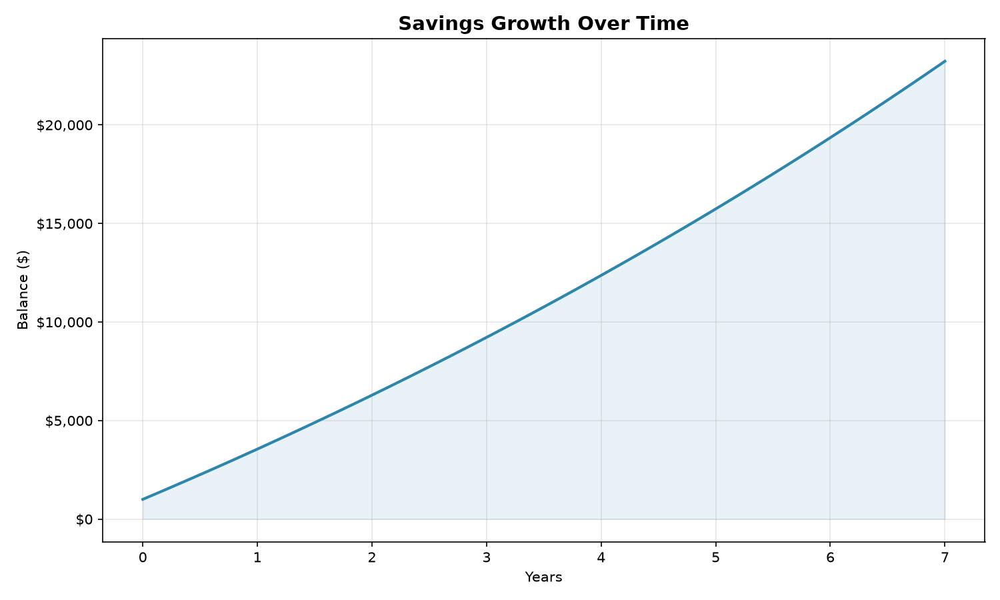

# Compound Interest / Savings Calculator

A Python command-line tool that calculates and visualizes how a savings
account grows over time with monthly contributions and compound interest.

## Why I built this

I'm a Grade 11 student planning to study Computer Science and Finance/Math
at university, and I wanted a project that sits at the intersection of both.
Compound interest is one of the first "big ideas" you learn in finance —
it's the reason a small, consistent monthly saving habit can turn into a
large sum over time. I wanted to actually build the math myself instead of
just using an online calculator, and turn it into something visual and
interactive using Python.

## What it does

The program asks you for:
- **Starting amount** — how much you're saving with initially
- **Monthly contribution** — how much you add every month
- **Annual interest rate** — the yearly rate of return, as a percentage
- **Number of years** — how long you want to project the growth

It then:
1. Calculates the balance at the end of every month using compound
   interest (interest is calculated and added monthly, not just once a
   year)
2. Prints a summary — total money contributed, total interest earned, and
   the final balance
3. Generates and saves a line chart (`savings_growth.png`) showing the
   balance growing over time

## Example

```
=== Compound Interest / Savings Calculator ===

Starting amount ($): 1000
Monthly contribution ($): 200
Annual interest rate (%, e.g. 5 for 5%): 7
Number of years: 10

--- Results after 10 year(s) ---
Total contributed:  $25,000.00
Interest earned:    $11,626.62
Final balance:      $36,626.62

Chart saved to 'savings_growth.png'
```



## How the math works

The core idea is that every month, two things happen to your balance:

1. It earns interest based on the current balance
2. You add your monthly contribution

```python
monthly_rate = annual_rate / 100 / 12
balance = balance * (1 + monthly_rate) + monthly_contribution
```

The annual rate gets divided by 12 to turn it into a monthly rate, and
divided by 100 to turn a percentage (like `7`) into a decimal (`0.07`).
This is repeated once for every month in the time period, which is what
creates compound growth — you eventually earn interest on interest you
earned in previous months, not just on your original contributions.

## Getting started

### Requirements
- Python 3.8+
- matplotlib (`pip install matplotlib`)

### Run it

```bash
git clone https://github.com/YOUR-USERNAME/savings-calculator.git
cd savings-calculator
pip install -r requirements.txt
python savings_calculator.py
```

## Project structure

```
savings-calculator/
├── savings_calculator.py   # main program
├── requirements.txt        # dependencies
└── README.md
```

## Possible next features

- **Inflation adjustment**: show the balance in today's dollars by also
  applying an inflation rate, so the chart reflects real purchasing power
  rather than just nominal dollars
- **Scenario comparison**: let the user run two or three scenarios (e.g.
  different interest rates or contribution amounts) and plot them on the
  same chart to compare outcomes side by side

## About me

I'm an international student from Bangladesh studying in British Columbia,
Canada, applying to university for Fall 2027 with interests in Computer
Science, Finance, and Math. This project is part of my portfolio for
university and scholarship applications.
